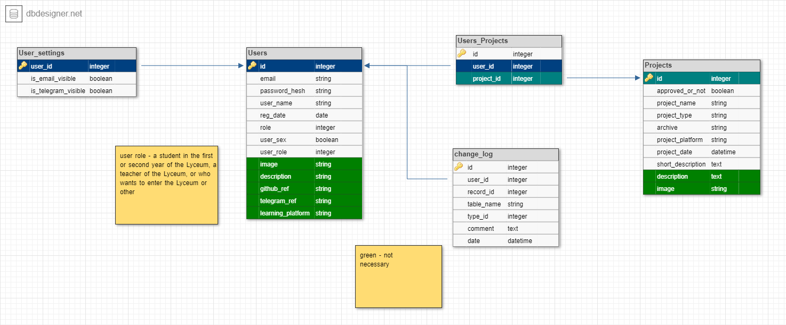

# Название

## Формулировки

Добавленный проект - проект, который загрузил пользователь на сайт, но который не был одобрен модераторами.

Опубликованный проект - проект, который одобрили модераторы, только опубликованные проекты могут посмотреть обычные пользователи и гости сайта.

## Цель

Цель проекта - это создание удобного сервиса, куда люди могут выкладывать свои и просматривать чужие проекты. Это даст понятие какие-именно проекты создаются в Лицее Академии Яндекса (далее Лицей) людям, которые планируют поступать или уже учатся на первом курсе, так же второкурсники могут найти интересные идеи и вдохновения в чужих проектах.

## Учётные записи

На сайте  будут следующие типы учётных записей, в зависимости от учётной записи пользователя будут возможности на сайте.

Каждый следующий тип учётный записи имеет возможности всех вышестоящих типов учётных записей.

*guest - гость, любой не авторизированный пользователь, может просматривать чужие проекты

- user - обычный рядовой авторизированный пользователь, может добавлять проекты.
- moder - модератор, назначается администратором(см. след. пункт),  просматривает добавленные проекты, если модератор одобряет добавленный проект, то этот проект появляется в списке всех проектов, иначе не модераторы и не админы не увидят этот проект. Осуществляет связь между пользователем и администратором в случае критической проблемы.
- admin - администратор, может назначать/"увольнять" модераторов, банить/удалять страницы пользователей, просматривать какие проекты какой модератор когда одобрил/не одобрил.

**удалять/добавлять администраторов могут только владельцы.

## Модули

#### Сайт состоит из следующих основных страниц:

###### Блоки находящиеся на каждой странице:

- Navbar(навигационная панель) - находиться сверху любой страницы, с помощью navbar'а осуществляется основная навигация по сайту, если экран не достаточный ширины, навигационная панель будет сворачиваться и на месте её будет кнопка, по нажатию на которую навигационная панель будет отображаться вертикально. Слева навигационной панели будет находиться логотип, справа - переход на страницу учётной записи или на страницу регистрации, по центру - остальные разделы.
- Footer(подвал) - находиться снизу любой страницы, на нём располагается дополнительная информация.

###### "Общие" страницы, на них может зайти любой пользователь:

- Главная страница - начальная страница, на ней располагается приветствие и несколько выложенных проектов.
- Страница авторизации, аутентификации - страница с помощью которой пользователь может зайти на свою учётную запись или страницу восстановления пароля или страницу регистрации.
- Страница восстановления пароля - страница на которой пользователей может ввести почту, на эту почту придёт письмо, если перейти по ссылке в письме, пользователь сможет ввести новый пароль.
- Страница регистрации - стандартная страница регистрации, при регистрации нужно обязательно указать: почту, пароль, имя пользователя, кем является пользователь (первокурсником или второкурсником Лицея, учитель Лицея, желающий поступить в Лицей, другое), пол, также не обязательно можно указать: контакты, дополнительную информацию, "аватар пользователя"(графическое представление пользователя, двухмерное изображение) площадка обучения, информацию в дальнейшем можно изменить или дополнить на странице пользователя.
- Страница проектов - страница на которой расположен список карточек всех опубликованных проектов, которые можно отсортировать с помощью ряда фильтров(например по дате публикации), на карточке проекта отображается краткое описание самого проекта и изображение, которое пользователь прикрепит при добавлении нового проекта. В случае нажатия на карточку проекта, пользователь перейдет на полную страницу проекта.
- Полная страница проекта - страница на которой расположено полное описание проекта, изображение проекта(аватарка), ссылки/контакты создателя проекта, архив для скачивания проекта и прочая информация, которую добавить создатель проекта при добавлении проекта. Также из этого раздела можно перейти на страницу пользователя. Если пользователь зашёл на свою полную страницу проекта, то он может изменять информацию на ней или удалить её.
- Страница пользователя - страница с основной информацией, контактами и проектами пользователя. Если пользователь зашёл на страницу со своей учётной записью, то он может изменять информацию на ней, удалить её, или выйти с нынешнего устройства с этой учётной записи. Так же можно поменять некоторые настройки.
- Страница "о нас" - страница на которой указывается информация и контакты создателей сайта и общая информация о сайте

###### Страницы доступные пользователям с учётной записью user и ниже(см. пункт. модули, начало):

- Страница добавления проекта - на данной странице авторизованный пользователь может добавить свой проект, при добавлении проекта нужно обязательно указать: краткое описание проекта, архив с проектом, дата защиты проекта, название проекта, тип проекта(PyQT, PyGame, PyWeb), дополнительно можно указать: изображение, описание, прочею информацию.

###### Страницы доступные пользователям с учётной записью moder и ниже(см. пункт. модули, начало):

- Страница добавленных проектов - страница на которой отображаются карточки добавленных проектов, которые ещё не рассмотрели модераторы, при нажатие на карточку модератор переходит на полную страницу проекта, где может одобрить/не одобрить проект. В случае не одобрения проекта модератор должен оставить комментарий, почему он принял такое решение.

###### Страницы доступные пользователям с учётной записью admin(см. пункт. модули, начало):

- Страница пользователей - список карточек всех пользователей, на карточке пользователя указывается: имя пользователя, какой у него тип учётной записи, когда последний раз заходил на сайт. При нажатие на карточку, администратор переходит на страницу пользователя, где может менять информацию, удалять аккаунт, менять тип учётной записи, в случае если администратор перешёл на страницу модератора, он также может посмотреть какие и когда данный модератор проекты одобрил/не одобрил, а также перейти на страницу проекта, в случае если проект был не одобрен модератором, администратор увидит комментарий модератора.

*У администраторов расширяется страница проектов, они видят когда и какой модератор одобрил этот проект.

## Стек технологий

Flask

HTML 5

CSS

Bootstrap 5

Flask-wtf

sqlalchemy

SQLite

db designer

figma

github

PyCharm

...

## База данных

Архитектура базы данных представлена на изображении ниже:

Ссылка на полную документацию базы данных: https://sqlspy.io/import_db_designer/c3B5LTM3MjUzOTgtMjA5ODgwNjQ2M2IzMWExMC02MTYxMTI=

## Сроки и распределение задач

...